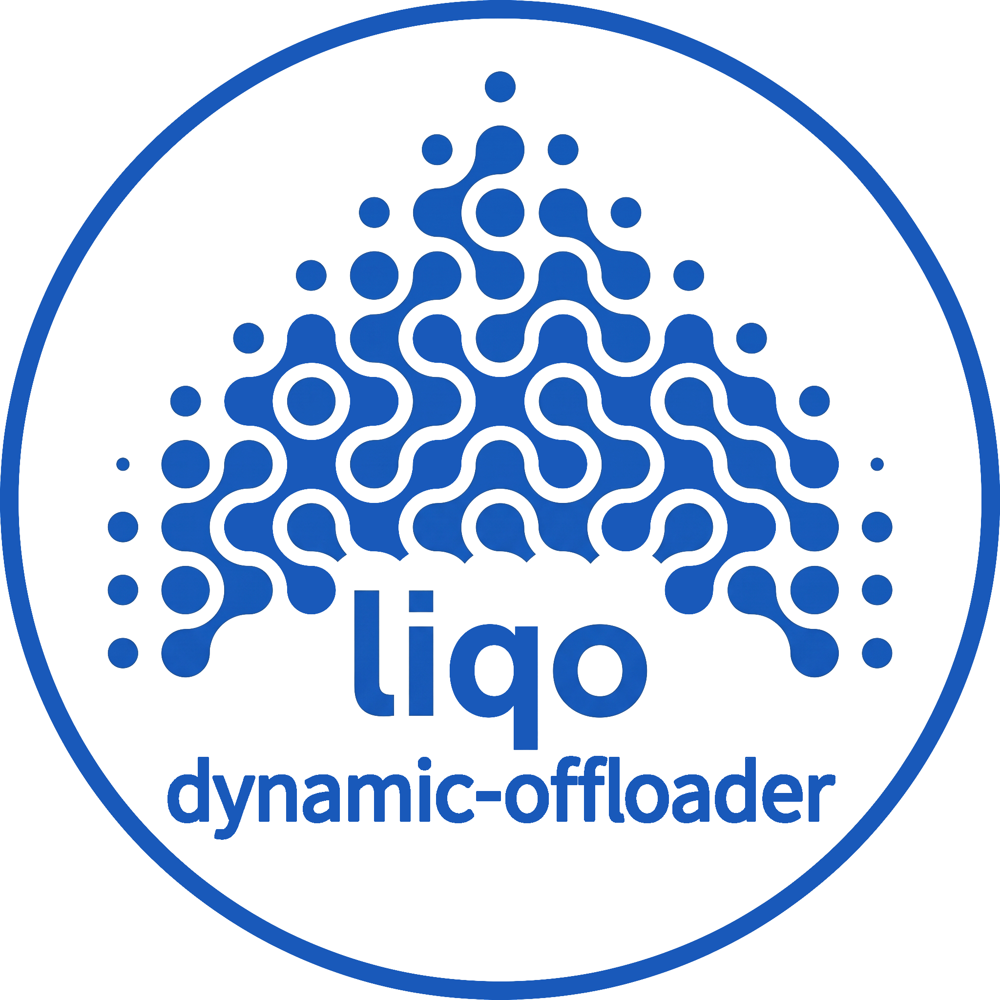

<p align="center">
  
</p>

# liqo-dynamic-offloader
*Read this in other languages: [Italiano](./docs/README.it.md)*

An event-driven Kubernetes operator for the automatic recovery of workloads that get stuck in `OffloadingBackOff` during Liqo offloading to a remote cluster.

The operator observes pod updates and the state produced by the Liqo Virtual Kubelet, temporarily enables offloading for the involved namespace, forces a workload retry, and removes the configuration when there are no more active remote pods.

## Overview

Liqo keeps namespaces isolated until a `NamespaceOffloading` resource exists. If a pod is scheduled to a remote virtual node without this policy, the Virtual Kubelet rejects the reflection, and the pod may manifest the `OffloadingBackOff` lock in its pod status or in a container's waiting state.

`liqo-dynamic-offloader` solves this issue without requiring static configurations for each namespace:

1. Intercepts the creation or update of a pod in `OffloadingBackOff`.
2. Creates the `NamespaceOffloading` resource with the configured remote cluster.
3. Deletes the stuck pod, leaving the relevant Kubernetes workload controller the task of recreating it.
4. Observes the lifecycle of remote pods.
5. Revokes the policy when no active remote pods remain, restoring namespace isolation.

## Architecture

The main process in `main.go` starts a single `controller-runtime` manager with two independent reconcilers.

### Trap Controller

  The **Trap Controller** directly observes Kubernetes `Pod` resources. The predicate allows creations and updates to pass through, while the reconciliation loop applies early exits and authoritatively verifies the current pod state. A pod is considered trapped when `OffloadingBackOff` appears in `status.reason`, a container's waiting state, or an init container's waiting state.

  When a trap is detected, it ignores excluded namespaces and pods already terminating. For other namespaces, it:

  * Creates `NamespaceOffloading/offloading` in the pod's namespace.
  * Configures `namespaceMappingStrategy: DefaultName`.
  * Uses `podOffloadingStrategy: LocalAndRemote`.
  * Constrains offloading via the `liqo.io/remote-cluster-id` label if clusters are specified in `TARGET_CLUSTER_ID`; otherwise, it leaves the configuration open to delegate load balancing to Liqo.
  * Waits for the `TRAP_BACKOFF` period, allowing Liqo webhooks time to register the new policy.
  * Re-reads the pod after the wait and deletes it with background propagation only if it is still in `OffloadingBackOff`.

  If the policy already exists, the controller respects the `TRAP_BACKOFF` cooldown of the last remediation before proceeding. If Liqo has already recovered the pod during the backoff, deletion is skipped. Otherwise, the Deployment, ReplicaSet, or other controller can create a new instance once the policy is applied.

### Cleanup Controller

  The **Cleanup Controller** observes pods and reconciles only the changes relevant to counting remote workloads: creation, deletion, phase change, node assignment, or entry into graceful shutdown.

  Before counting pods, the controller checks the age of the `NamespaceOffloading`. A newly created policy is not removed: the reconcile is rescheduled after the `CLEANUP_GRACE_PERIOD`, allowing Liqo and the Trap Controller to complete unblocking and scheduling.

  Once the grace period elapses, for each namespace with a `NamespaceOffloading`, it considers pods active if they:

  * Are assigned to the remote cluster.
  * Require the remote cluster via `kubernetes.io/hostname`.
  * Are still `Pending` but destined for the remote cluster.
  * Are terminating, even if deletion has already started.

  The policy is deleted only when the active count drops to zero. This ensures **Graceful Shutdown** is respected: a terminating pod maintains offloading until it has completely exited the workload. Upon successful cleanup, the controller also generates a `Successful Cleanup` Kubernetes normal event.

## Features

### Dynamic Configuration

The operator does not hardcode the remote cluster ID or the list of protected namespaces. Configuration is read at startup via environment variables:

| Variable | Description | Default |
| --- | --- | --- |
| `TARGET_CLUSTER_ID` | Comma-separated list of Liqo cluster IDs to enable offloading to. If left empty, cluster selection is delegated to the Liqo scheduler. | *(empty)* |
| `EXCLUDED_NAMESPACES` | Comma-separated list of namespaces to ignore. Spaces are trimmed. | `kube-system,liqo-system,local-path-storage,crownlabs-system` |
| `TRAP_BACKOFF` | Wait duration after policy creation before re-checking the stuck pod. | `2s` |
| `CLEANUP_GRACE_PERIOD` | Minimum policy age before the Cleanup Controller can evaluate its revocation. | `10s` |

### High Availability

The manager uses `controller-runtime` **Leader Election** with the ID `liqo-auto-healing-lock` and saves the lock in the `default` namespace (via `Lease` resources). You can run multiple replicas of the operator: only one replica becomes the leader and performs reconciliation, while the others remain on standby ready to take over in case of failure.

### Observability

The Cleanup Controller publishes Prometheus metrics to the `controller-runtime` registry:

* `liqo_cleanup_namespaces_total`: Counter of successfully revoked offloading policies.
* `liqo_cleanup_active_remote_pods{namespace="..."}`: Gauge of the number of active or gracefully shutting down remote pods per namespace.

In addition to structured logs, every completed cleanup produces a native Kubernetes event with the reason `Successful Cleanup`.

## Prerequisites

* Docker
* [kind](https://kind.sigs.k8s.io/?utm_source=gemini)
* `kubectl`
* `liqoctl` 1.0 or newer
* Go 1.22 or newer
* Bash, Git Bash, or WSL to run `.sh` scripts on Windows

The scripts create two kind clusters named `cluster-local` and `cluster-remote`, install Liqo, and link them via a NodePort gateway.

## Infrastructure Setup

From the repository root, make the scripts executable and start the setup:

```bash
chmod +x scripts/*.sh
./scripts/1-setup.sh
```

The script waits for the virtual node creation in the local cluster and for it to become `Ready`. Once completed, no application namespaces are offloaded yet.

## Demo 1: Local Development (`go run`)

Ensure `kubectl` is pointing to the local cluster:

```bash
kubectl config use-context kind-cluster-local
```

In one terminal, start the operator from the repository root:

```bash
make run
```

In a second terminal, launch the interactive demo script:

```bash
./scripts/2-demo.sh
```

## Demo 2: In-Cluster Production (Docker)

To test the operator exactly as it would run in a real environment (e.g., CrownLabs), you can build the image and inject it into the cluster using a single script that also applies the RBAC manifests and the Deployment:

```bash
make docker-build
./scripts/3-demo-complete.sh
```

The script will configure permissions (including Leader Election), start the operator Pod, create the "trap" for Liqo, and display the streaming logs of the automatic recovery.

To explicitly restore the initial scenario:

```bash
./scripts/0-reset.sh
```

## Automated Tests

The Go module contains comprehensive unit tests for the reconcilers and event-driven predicates:

```bash
go test -v ./...
```

The tests cover pods in `OffloadingBackOff`, pre-existing policies, excluded namespaces, terminating pods, active remote pods, pending remote-bound pods, terminal pods, and local pods.

## Build and Containerization

To generate RBAC manifests using Kubebuilder markers:

```bash
make manifests
```

To compile the local binary to `bin/manager`:

```bash
make build
```

To build the containerized Docker image:

```bash
make docker-build IMG=yourusername/liqo-dynamic-offloader:latest
```

### Pre-built Images (Docker Hub & GHCR)
If you want to use the operator without compiling it from source, you can reference the public images hosted on either Docker Hub or GitHub Container Registry directly in your Kubernetes manifests or Deployments:

**Option 1: Docker Hub**
```yaml
    spec:
      containers:
      - name: manager
        image: samvia/liqo-dynamic-offloader:latest
```

**Option 2: GitHub Container Registry (GHCR)**

```yaml
    spec:
      containers:
      - name: manager
        image: ghcr.io/samvia/liqo-dynamic-offloader:latest
```


### Deployment Example with Environment Variables

When deploying the operator in a real cluster, you can inject the dynamic configuration directly into the container spec using the `env` array.

Here is a complete example of a Kubernetes Deployment manifest using the GHCR image and setting the configuration variables:

```yaml
apiVersion: apps/v1
kind: Deployment
metadata:
  name: liqo-dynamic-offloader
  namespace: default
spec:
  replicas: 1
  selector:
    matchLabels:
      app: liqo-dynamic-offloader
  template:
    metadata:
      labels:
        app: liqo-dynamic-offloader
    spec:
      containers:
      - name: manager
        image: ghcr.io/samvia/liqo-dynamic-offloader:latest
        imagePullPolicy: Always
        env:
        # 1. Target clusters (comma-separated). Leave empty to let Liqo balance automatically.
        - name: TARGET_CLUSTER_ID
          value: "cluster-remote-1"
        # 2. Protected namespaces that the operator will never touch
        - name: EXCLUDED_NAMESPACES
          value: "kube-system,liqo-system,local-path-storage,crownlabs-system,my-custom-ns"
        # 3. Timeouts and Grace periods
        - name: TRAP_BACKOFF
          value: "2s"
        - name: CLEANUP_GRACE_PERIOD
          value: "10s"
```

## Repository Structure

```text
.
├── Dockerfile
├── Makefile
├── README.md
├── go.mod
├── go.sum
├── main.go
├── controllers/
│   ├── liqo_cleanup_controller.go
│   ├── liqo_cleanup_controller_test.go
│   ├── liqo_trap_controller.go
│   ├── liqo_trap_controller_test.go
│   └── predicates_test.go
├── config/
│   └── rbac/
│       └── role.yaml
├── docs/
│   ├── demo_advanced.md
│   ├── demo_base.md
│   ├── demo_complete.md
│   └── docs.md
└── scripts/
    ├── 0-reset.sh
    ├── 1-setup.sh
    ├── 2-demo.sh
    └── 3-demo-complete.sh
```

The documents inside `docs/` explore in-depth architectural technical details and advanced testing logs collected during development.

## Security and Operational Behavior

* Excluded system namespaces are ignored and not modified by the operator.
* The Trap Controller prevents hot-loops by ignoring pods already in termination and does not delete a pod that Liqo has already recovered during the backoff period.
* The Cleanup Controller will not remove a policy before the grace period expires, nor while there is an active or terminating remote pod.
* Cluster access or deletion errors are returned by the reconciliation loop and retried following standard `controller-runtime` behavior.
* Kubernetes permissions are required to read and observe **Nodes** and Pods, manage the `NamespaceOffloading` custom resources, emit events, and manage `Leases` for Leader Election.