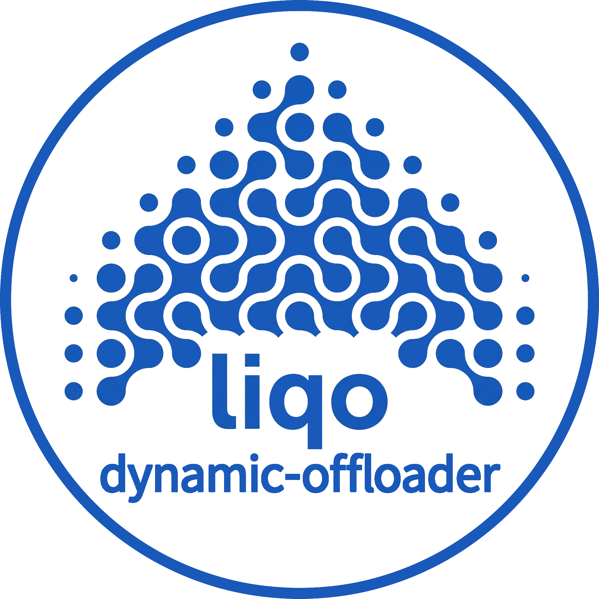

<p align="center">
  
</p>

# liqo-dynamic-offloader
*Read this in other languages: [Italiano](./docs/README.it.md)*

An event-driven Kubernetes operator for the automatic recovery of workloads that get stuck in `OffloadingBackOff` during Liqo offloading to a remote cluster.

The operator observes pod updates and the state produced by the Liqo Virtual Kubelet, temporarily enables offloading for the involved namespace, forces a workload retry, and removes the configuration when there are no more active remote pods.

## Overview

Liqo keeps namespaces isolated until a `NamespaceOffloading` resource exists. If a pod is scheduled to a remote virtual node without this policy, the Virtual Kubelet rejects the reflection, and the pod may manifest the `OffloadingBackOff` lock in its pod status or in a container's waiting state.

`liqo-dynamic-offloader` solves this issue without requiring static configurations for each namespace:

1. Intercepts the creation or update of a pod in `OffloadingBackOff`.
2. Creates the `NamespaceOffloading` resource with the configured remote cluster.
3. Applies a `dynamic-offloader.liqo.io/force-sync` annotation to the stuck pod, requesting an in-place synchronization without deleting the workload.
4. Observes the lifecycle of remote pods.
5. Starts a durable cleanup countdown when no active remote pods remain and revokes the policy after the configured delay.

## Architecture

The main process in `main.go` starts a single `controller-runtime` manager with two independent reconcilers.

### Trap Controller

  The **Trap Controller** directly observes Kubernetes `Pod` resources. The predicate allows creations and updates to pass through, while the reconciliation loop applies early exits and authoritatively verifies the current pod state. A pod is considered trapped when `OffloadingBackOff` appears in `status.reason`, a container's waiting state, or an init container's waiting state.

  When a trap is detected, it ignores excluded namespaces and pods already terminating. For other namespaces, it:

  * Creates `NamespaceOffloading/offloading` in the pod's namespace.
  * Configures `namespaceMappingStrategy: DefaultName`.
  * Uses `podOffloadingStrategy: LocalAndRemote`.
  * Constrains offloading via the `liqo.io/remote-cluster-id` label if clusters are specified with `--target-cluster-ids`; otherwise, it delegates cluster selection to Liqo.
  * Waits for the `--trap-backoff` period, allowing Liqo's asynchronous admission and scheduling logic to process the new policy.
  * Re-reads the pod after the wait and applies the force-sync annotation only if it is still in `OffloadingBackOff`.

  If the policy already exists, the controller respects the namespace-level remediation cooldown before proceeding. If Liqo has already recovered the pod during the backoff, no mutation is performed. Dry-run mode logs the intended action without creating or updating resources.

### Cleanup Controller

  The **Cleanup Controller** observes pods and reconciles only the changes relevant to counting remote workloads: creation, deletion, phase change, node assignment, or entry into graceful shutdown.

  For each namespace with a `NamespaceOffloading`, it considers pods active if they:

  * Are assigned to the remote cluster.
  * Require the remote cluster via `kubernetes.io/hostname`.
  * Are still `Pending` but destined for the remote cluster.
  * Are terminating, even if deletion has already started.

  When the active count drops to zero, the controller stores an `empty-since` timestamp and requeues after `--cleanup-delay`. If remote work appears during the countdown, the timestamp is removed. Once the delay expires, the policy is deleted. This ensures **Graceful Shutdown** is respected: a terminating pod maintains offloading until it has completely exited the workload. Upon successful cleanup, the controller also generates a `Successful Cleanup` Kubernetes normal event.

## Features

### Dynamic Configuration

The operator is configured at startup through command-line flags. The Helm chart maps values under `config` to these flags:

| Flag | Description | Default |
| --- | --- | --- |
| `--target-cluster-ids` | Comma-separated Liqo cluster IDs. Empty delegates selection to Liqo. | *(empty)* |
| `--excluded-namespaces` | Comma-separated namespaces to ignore. Supports glob patterns such as `*-system`. | `kube-system,liqo-system` |
| `--trap-whitelist-labels` | Namespace `key=value` labels required to enable Trap remediation. | *(empty)* |
| `--trap-blacklist-labels` | Namespace `key=value` labels that disable Trap remediation. | *(empty)* |
| `--cleanup-whitelist-labels` | Namespace `key=value` labels required to enable Cleanup. | *(empty)* |
| `--cleanup-blacklist-labels` | Namespace `key=value` labels that disable Cleanup. | *(empty)* |
| `--trap-backoff` | Wait duration before rechecking a trapped pod. | `2s` |
| `--cleanup-delay` | Countdown before deleting an empty offloading policy. `0` disables automatic cleanup. | `10s` |
| `--dry-run` | Logs intended actions without modifying cluster state. | `false` |

### High Availability

The manager uses `controller-runtime` **Leader Election** with the ID `liqo-auto-healing-lock` and saves the lock in the `default` namespace (via `Lease` resources). You can run multiple replicas of the operator: only one replica becomes the leader and performs reconciliation, while the others remain on standby ready to take over in case of failure.

### Observability

The Cleanup Controller publishes Prometheus metrics to the `controller-runtime` registry:

* `liqo_cleanup_namespaces_total`: Counter of successfully revoked offloading policies.
* `liqo_cleanup_active_remote_pods{namespace="..."}`: Gauge of the number of active or gracefully shutting down remote pods per namespace.

In addition to structured logs, every completed cleanup produces a native Kubernetes event with the reason `Successful Cleanup`.

## Prerequisites

* Docker
* [kind](https://kind.sigs.k8s.io/?utm_source=gemini)
* `kubectl`
* `liqoctl` 1.0 or newer
* Go 1.22 or newer
* Bash, Git Bash, or WSL to run `.sh` scripts on Windows

The scripts create two kind clusters named `cluster-local` and `cluster-remote`, install Liqo, and link them via a NodePort gateway.

## Infrastructure Setup

From the repository root, make the scripts executable and start the setup:

```bash
chmod +x scripts/*.sh
./scripts/1-setup.sh
```

The script waits for the virtual node creation in the local cluster and for it to become `Ready`. Once completed, no application namespaces are offloaded yet.

## Demo 1: Local Development (`go run`)

Ensure `kubectl` is pointing to the local cluster:

```bash
kubectl config use-context kind-cluster-local
```

In one terminal, start the operator from the repository root:

```bash
make run
```

In a second terminal, launch the interactive demo script:

```bash
./scripts/2-demo.sh
```

## Demo 2: In-Cluster Production (Helm)

To test the operator exactly as it would run in a real environment, deploy
the Helm chart with the remote GHCR image:

```bash
./scripts/3-demo-complete.sh
```

The script keeps pulling the image by default using
`ghcr.io/samvia/liqo-dynamic-offloader:latest` and
`imagePullPolicy: Always`. Override the image without editing the script:

```bash
IMAGE_TAG=0.1.0 IMAGE_PULL_POLICY=IfNotPresent ./scripts/3-demo-complete.sh
```

The script installs or upgrades the Helm release, configures the controller
flags, creates the test namespaces and workloads, and streams the operator
logs. Use `--dry-run` to validate filtering without mutating cluster state.

To explicitly restore the initial scenario:

```bash
./scripts/0-reset.sh
```

## Helm Deployment

The recommended deployment method is the Helm chart in
`charts/liqo-dynamic-offloader`. It creates the controller Deployment,
ServiceAccount, ClusterRole, and ClusterRoleBinding.

Validate and render the chart:

```bash
helm lint charts/liqo-dynamic-offloader
helm template liqo-dynamic-offloader charts/liqo-dynamic-offloader \
  --namespace liqo-system
```

Install or upgrade the operator:

```bash
helm upgrade --install liqo-dynamic-offloader \
  charts/liqo-dynamic-offloader \
  --namespace liqo-system \
  --create-namespace \
  --set image.tag=0.1.0 \
  --set config.targetClusterIDs=cluster-remote
```

For label-based policy gates, use string values:

```bash
helm upgrade --install liqo-dynamic-offloader \
  charts/liqo-dynamic-offloader \
  --namespace liqo-system \
  --create-namespace \
  --set-string config.trapBlacklistLabels=dynamic-offloader.liqo.io/ignore-trap=true \
  --set-string config.cleanupBlacklistLabels=dynamic-offloader.liqo.io/ignore-cleanup=true
```

Webhook support is reserved for a future release and is disabled. The current
controller does not expose a webhook endpoint, Service, or certificate
integration; keep `webhook.enabled` set to `false`.

## Automated Tests

The Go module contains comprehensive unit tests for the reconcilers and event-driven predicates:

```bash
go test -v ./...
```

The tests cover pods in `OffloadingBackOff`, pre-existing policies, excluded namespaces, terminating pods, active remote pods, pending remote-bound pods, terminal pods, and local pods.

## Build and Containerization

To generate RBAC manifests using Kubebuilder markers:

```bash
make manifests
```

To compile the local binary to `bin/manager`:

```bash
make build
```

To build the containerized Docker image:

```bash
make docker-build IMG=yourusername/liqo-dynamic-offloader:latest
```

### Pre-built Images (Docker Hub & GHCR)
If you want to use the operator without compiling it from source, you can reference the public images hosted on either Docker Hub or GitHub Container Registry directly in your Kubernetes manifests or Deployments:

**Option 1: Docker Hub**
```yaml
    spec:
      containers:
      - name: manager
        image: samvia/liqo-dynamic-offloader:latest
```

**Option 2: GitHub Container Registry (GHCR)**

```yaml
    spec:
      containers:
      - name: manager
        image: ghcr.io/samvia/liqo-dynamic-offloader:latest
```


## Repository Structure

```text
.
├── Dockerfile
├── Makefile
├── README.md
├── go.mod
├── go.sum
├── main.go
├── charts/
│   └── liqo-dynamic-offloader/
├── controllers/
│   ├── liqo_cleanup_controller.go
│   ├── liqo_cleanup_controller_test.go
│   ├── liqo_trap_controller.go
│   ├── liqo_trap_controller_test.go
│   └── predicates_test.go
├── config/
│   └── rbac/
│       └── role.yaml
├── docs/
│   ├── demo_advanced.md
│   ├── demo_base.md
│   ├── demo_complete.md
│   └── docs.md
└── scripts/
    ├── 0-reset.sh
    ├── 1-setup.sh
    ├── 2-demo.sh
    ├── 3-demo-complete.sh
    └── 4-locale.sh
```

The documents inside `docs/` explore in-depth architectural technical details and advanced testing logs collected during development.

## Security and Operational Behavior

* Excluded system namespaces are ignored and not modified by the operator.
* The Trap Controller prevents hot-loops by ignoring pods already in termination and does not modify a pod that Liqo has already recovered during the backoff period.
* The Cleanup Controller will not remove a policy before the grace period expires, nor while there is an active or terminating remote pod.
* Cluster access or deletion errors are returned by the reconciliation loop and retried following standard `controller-runtime` behavior.
* Kubernetes permissions are required to read and observe **Nodes** and Pods, manage the `NamespaceOffloading` custom resources, emit events, and manage `Leases` for Leader Election.